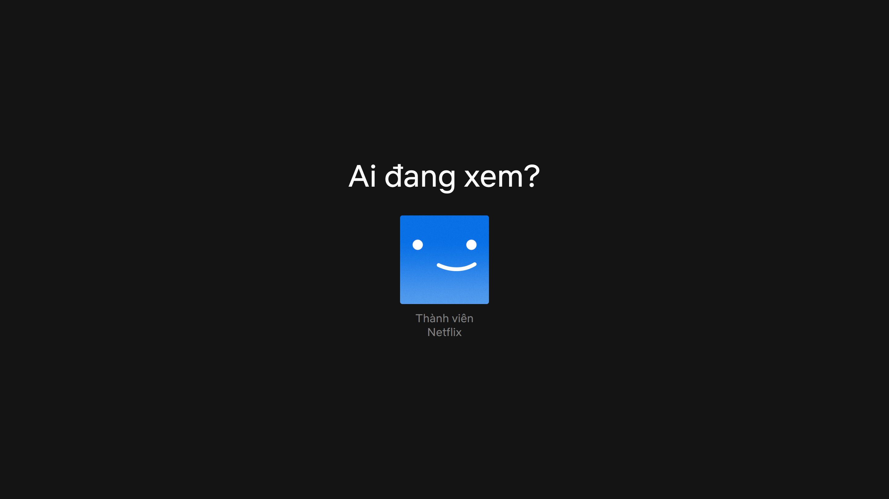

# Introduction

<p>Build Movie App with ReactJS, TypeScript, Redux and Firebase.</p>

# Page

- Home Page


- Login Page


- Sign Up Page


- Profile Page



- Search Page


- My list Page


## Installation

1. Clone the project from github

   ```sh
   git clone https://github.com/TripleT511/movie-app-with-reactjs-and-typescript.git
   ```

2. Install NPM packages

   ```sh
   npm install
   ```

3. Create .env file and fill in the necessary information from the Firebase Authentication provided

   ```sh
   REACT_APP_FIREBASE_API_KEY = 'xxxxxxxxxxxxxxxxxxxxxxxxxxxxxxxxxx'
   REACT_APP_FIREBASE_AUTH_DOMAIN = 'xxxxxxxxxxxxxxxxxxxxxxxx'
   REACT_APP_FIREBASE_PROJECT_ID = 'xxxxxxxx'
   REACT_APP_FIREBASE_STORAGE_BUCKET = 'xxxxxxxxxxxxxxxxxxxxxxxxxx'
   REACT_APP_FIREBASE_MESSAGING_SENDER_ID = 'xxxxxxxxxxxxxxxxxxx'
   REACT_APP_FIREBASE_APP_ID = 'x:xxxxxx:xxxx:xxxxxxxxxxxx'
   ```

4. Start App

   ```sh
   npm start
   ```
